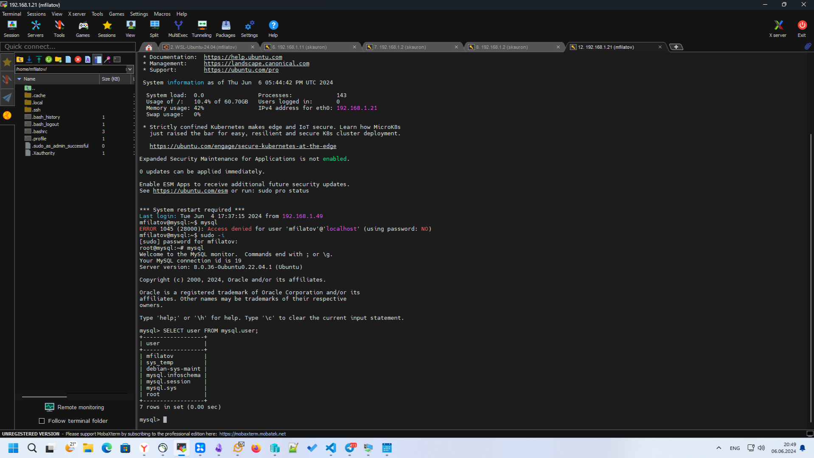

# Домашнее задание к занятию «Работа с данными (DDL/DML)» `Филатов Михаил`

### Задание 1
1.1. Поднимите чистый инстанс MySQL версии 8.0+. Можно использовать локальный сервер или контейнер Docker.
```bash
# Проверяем версию в репозитории
sudo apt update && sudo apt show mysql-server mysql-client

# Если версия в основном репозитории 8.0 и выше, то устанавливаем
sudo apt install mysql-server mysql-client -y

# Меняем политики безопасности и зп одно создаем пароль root
sudo mysql_secure_installation
```

1.2. Создайте учётную запись sys_temp. 

```bash
mysql -u root -p
```

```sql
#используем символ "%" что бы иметь возможность подключения из удаленных хостов.
CREATE USER 'sys_temp'@'%' IDENTIFIED BY 'password'; 
```
1.3. Выполните запрос на получение списка пользователей в базе данных. (скриншот)

```sql
SELECT user FROM mysql.user;
```


1.4. Дайте все права для пользователя sys_temp. 

```sql
GRANT ALL PRIVILEGES ON *.* TO 'sys_temp'@'%';
```

1.5. Выполните запрос на получение списка прав для пользователя sys_temp. (скриншот)

```sql
SHOW GRANTS FOR 'sys_temp'@'%';
```


1.6. Переподключитесь к базе данных от имени sys_temp.

```bash
mysql -u sys_temp -p
```

Для смены типа аутентификации с sha2 используйте запрос: 
```sql
ALTER USER 'sys_test'@'localhost' IDENTIFIED WITH mysql_native_password BY 'password';
```
1.6. По ссылке https://downloads.mysql.com/docs/sakila-db.zip скачайте дамп базы данных.

```bash
wget https://downloads.mysql.com/docs/sakila-db.zip

#В случае отсутствия утилиты "unzip" устанавливаем
sudo apt install unzip -y

unzip ./sakila-db.zip 
```

1.7. Восстановите дамп в базу данных.
```sql
CREATE DATABASE db DEFAULT CHARACTER SET utf8 DEFAULT COLLATE utf8_general_ci;
GRANT ALL PRIVILEGES ON db.* TO 'sys_temp'@'%';
```
```bash
mysql -u sys_temp -p db < /root/sakila-db/sakila-schema.sql
mysql -u sys_temp -p db < /root/sakila-db/sakila-data.sql
```
1.8. При работе в IDE сформируйте ER-диаграмму получившейся базы данных. При работе в командной строке используйте команду для получения всех таблиц базы данных. (скриншот)

```sql
USE sakila;
SHOW TABLES;
```

---

### Задание 2
Составьте таблицу, используя любой текстовый редактор или Excel, в которой должно быть два столбца: в первом должны быть названия таблиц восстановленной базы, во втором названия первичных ключей этих таблиц. Пример: (скриншот/текст)
```
Название таблицы | Название первичного ключа
customer         | customer_id
```
### Ответ 2.

|table_name     |primary_key_name|
|-------------  |----------------|
|actor          |actor_id        |
|address        |address_id      |
|category       |category_id     |
|city           |city_id         |
|country        |country_id      |
|customer       |customer_id     |
|film           |film_id         |
|film_actor     |actor_id        |
|film_actor     |film_id         |
|film_category  |film_id         |
|film_category  |category_id     |
|film_text      |film_id         |
|inventory      |inventory_id    |
|language       |language_id     |
|payment        |payment_id      |
|rental         |rental_id       |
|staff          |staff_id        |
|store          |store_id        |