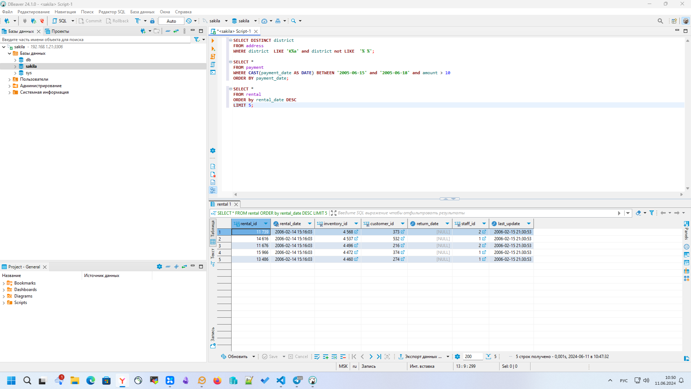

Домашнее задание к занятию «SQL. Часть 1» - `Михаил Филатов`

---

Задание можно выполнить как в любом IDE, так и в командной строке.

### Задание 1

Получите уникальные названия районов из таблицы с адресами, которые начинаются на “K” и заканчиваются на “a” и не содержат пробелов.

### Ответ 1
```sql
SELECT DISTINCT district 
FROM address 
WHERE district  LIKE 'K%a' and district not LIKE  '% %';
```


---

### Задание 2

Получите из таблицы платежей за прокат фильмов информацию по платежам, которые выполнялись в промежуток с 15 июня 2005 года по 18 июня 2005 года **включительно** и стоимость которых превышает 10.00.

### Ответ 2
```sql
SELECT *, CAST(payment_date AS DATE)
FROM payment 
WHERE payment_date  BETWEEN '2005-06-15' and '2005-06-19' and amount > 10
ORDER BY payment_date;
```


---

### Задание 3

Получите последние пять аренд фильмов.

### Ответ 3

```sql
SELECT *
FROM rental
ORDER by rental_date DESC
LIMIT 5;
```



---

### Задание 4

Одним запросом получите активных покупателей, имена которых Kelly или Willie. 

Сформируйте вывод в результат таким образом:
- все буквы в фамилии и имени из верхнего регистра переведите в нижний регистр,
- замените буквы 'll' в именах на 'pp'.

### Ответ 4

```sql
SELECT LOWER(REPLACE(first_name, 'L', 'p')) AS Имя, LOWER(last_name) AS Фамилия 
FROM customer
WHERE first_name LIKE 'Willie' AND active = 1 
OR first_name  LIKE 'Kelly' AND active = 1;
```


