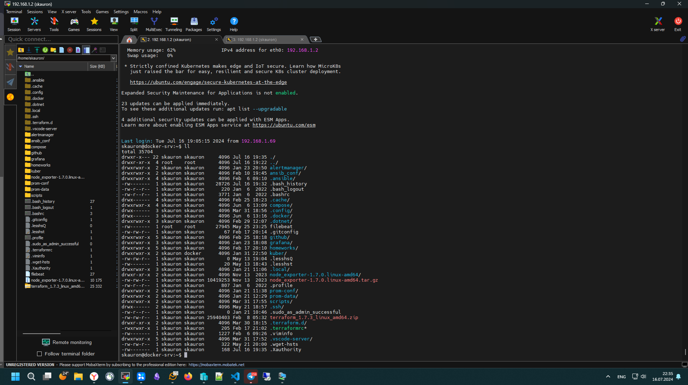
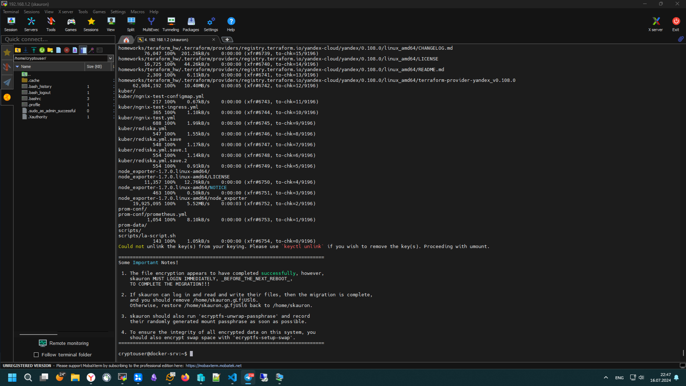
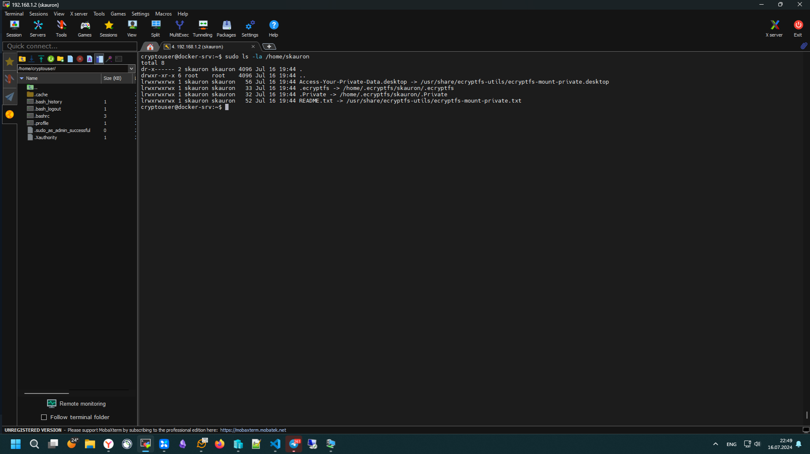
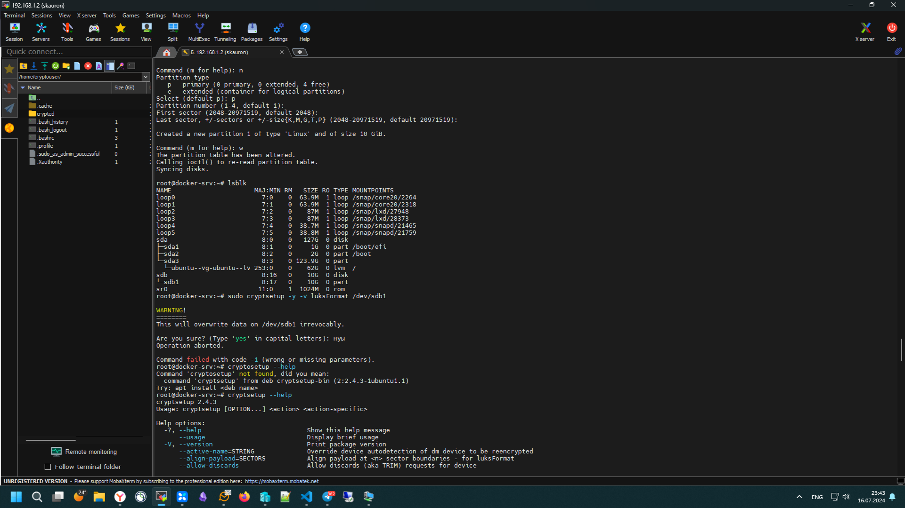
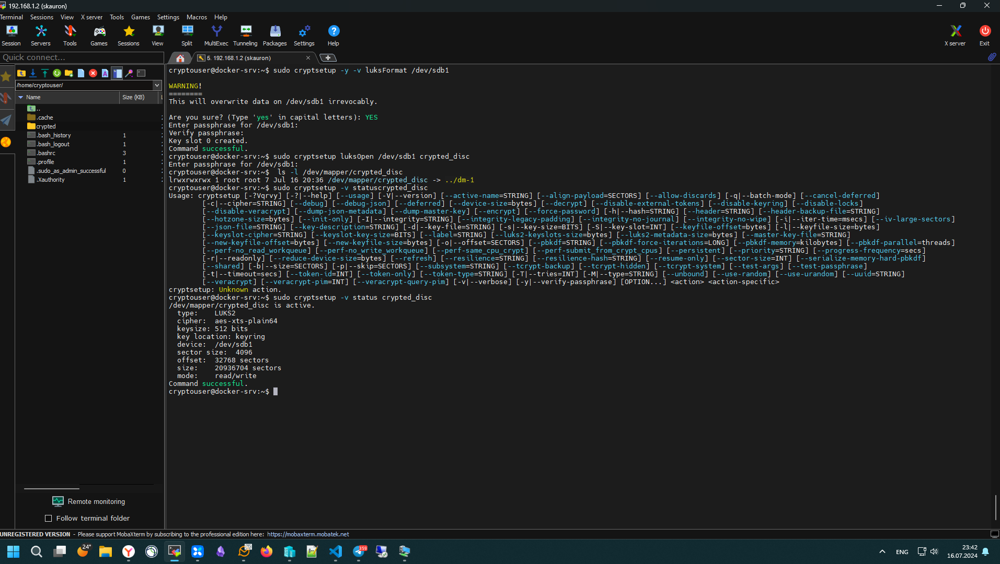

# Домашнее задание к занятию  «Защита хоста» Михаил Филатов

### Задание 1

1. Установите **eCryptfs**.
2. Добавьте пользователя cryptouser.
3. Зашифруйте домашний каталог пользователя с помощью eCryptfs.

*В качестве ответа  пришлите снимки экрана домашнего каталога пользователя с исходными и зашифрованными данными.*

### Ответ 1

- создаем пользователя с правами администратора

```bash
sudo useradd -G sudo -m  -s /bin/bash cryptouser
```

- входим под новым пользователем(предварительно выйдя из системы)

```bash
 sudo ecryptfs-migrate-home -u skauron
```





---

### Задание 2

1. Установите поддержку **LUKS**.
2. Создайте небольшой раздел, например, 100 Мб.
3. Зашифруйте созданный раздел с помощью LUKS.

*В качестве ответа пришлите снимки экрана с поэтапным выполнением задания.*

### Ответ 2

- добавляем блочное устройство и создаем на нем раздел


- создаем шифрованый раздел

```bash
sudo cryptsetup -y -v luksFormat /dev/sdb1
```

- подключаем шифрованое устройство

```bash
sudo cryptsetup luksOpen /dev/sdb1 crypted_disk
```

- проверяем его состояние

```bash
sudo cryptsetup -v status crypted_disk
```


