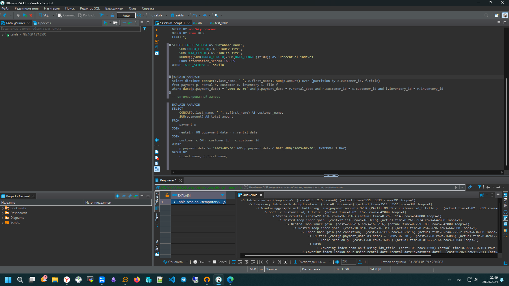
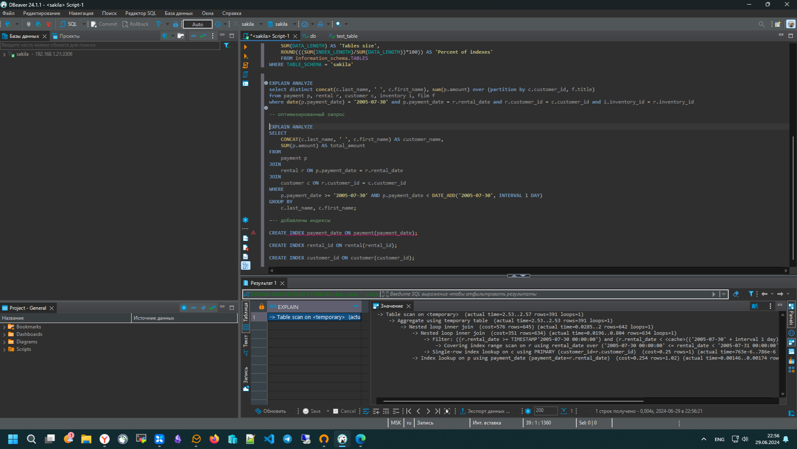

# Домашнее задание к занятию «Индексы»

### Задание 1

`Напишите запрос к учебной базе данных, который вернёт процентное отношение общего размера всех индексов к общему размеру всех таблиц.`

### Решение 1
```sql
SELECT TABLE_SCHEMA AS 'Database name', 
	SUM(INDEX_LENGTH) AS 'Index size', 
	SUM(DATA_LENGTH) AS 'Tables size', 
	ROUND(((SUM(INDEX_LENGTH)/SUM(DATA_LENGTH))*100)) AS 'Percent of indexes'
	FROM information_schema.TABLES
WHERE TABLE_SCHEMA = 'sakila'
```

---

### Задание 2

`Выполните explain analyze следующего запроса:`
```sql
select distinct concat(c.last_name, ' ', c.first_name), sum(p.amount) over (partition by c.customer_id, f.title)
from payment p, rental r, customer c, inventory i, film f
where date(p.payment_date) = '2005-07-30' and p.payment_date = r.rental_date and r.customer_id = c.customer_id and i.inventory_id = r.inventory_id
```
- `перечислите узкие места;`
- `оптимизируйте запрос: внесите корректировки по использованию операторов, при необходимости добавьте индексы.`

### Решение 2
EXPLAIN ANALYZE до оптимизации




Оптимизация:
- Удаляем лишние таблицы. Таблицы `inventory` и `film` исключены, так как их данные не используются в выборке.
- Используем явные `JOIN` для соединений. Явные `JOIN` более читаемы и управляемы, чем неявные соединения в блоке `WHERE`.
- Используем диапазон дат. Использование `DATE()` для преобразования `payment_date` в дату может замедлить запрос, так как оно применяется к каждому значению в столбце. Лучше использовать диапазон дат для фильтрации.
- Создаем индексы. Создание индексов на столбцах, используемых в условиях `WHERE` и соединениях, значительно ускоряет запросы.
```sql
-- оптимизированный запрос

EXPLAIN ANALYZE		
SELECT 
    CONCAT(c.last_name, ' ', c.first_name) AS customer_name,
    SUM(p.amount) AS total_amount
FROM 
    payment p
JOIN 
    rental r ON p.payment_date = r.rental_date
JOIN 
    customer c ON r.customer_id = c.customer_id
WHERE 
    p.payment_date >= '2005-07-30' AND p.payment_date < DATE_ADD('2005-07-30', INTERVAL 1 DAY)
GROUP BY 
    c.last_name, c.first_name;

--- добавлены индексы

CREATE INDEX payment_date ON payment(payment_date);

CREATE INDEX rental_id ON rental(rental_id);

CREATE INDEX customer_id ON customer(customer_id);
```

EXPLAIN ANALYZE после оптимизации
